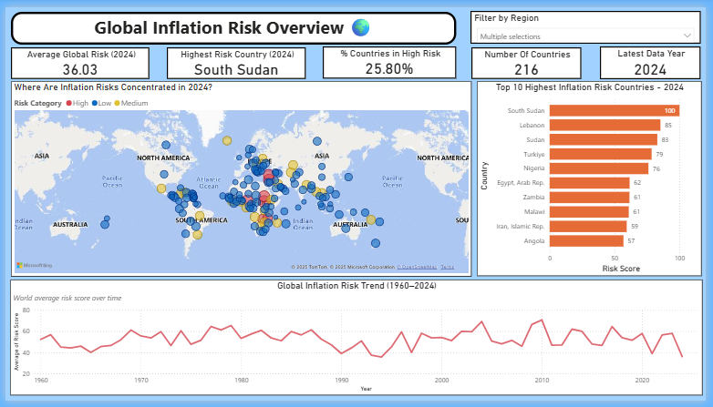
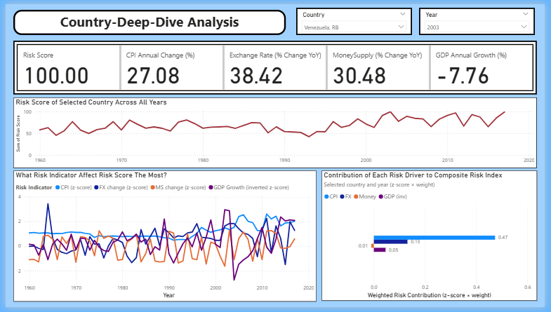
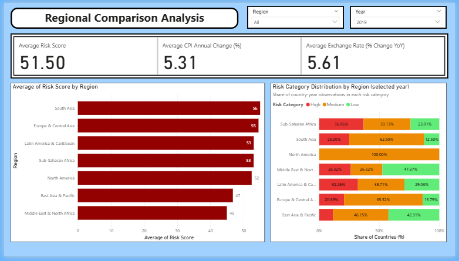
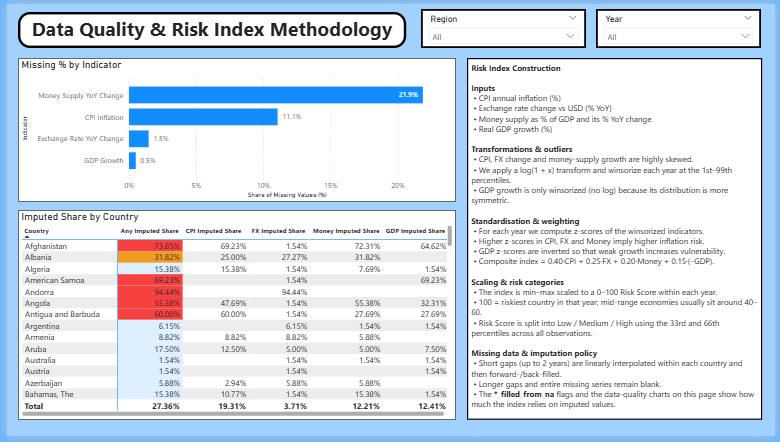

# Global Inflation Risk Analysis Dashboard

🚧 Work In Progress 🚧  
This project analyzes inflation risk across multiple countries using macroeconomic indicators.  
The goal is to build a data workflow, from data cleaning and exploratory analysis to risk scoring and interactive visualization using Power BI.

> ⚠️ **Disclaimer**:  
> The following exploratory analysis of this project is **descriptive in nature** and focuses on patterns observable directly in the data.
> This project **not aim to provide deeper economic interpretation**, as the main purpose of this project is to demonstrate a full **data analytics and dashboarding workflow**.

---

## Tools & Stack 🛠️
- **Python**: pandas, numpy, matplotlib, seaborn
- **Power BI**: interactive dashboard for visualization & reporting

---

## Folder Structure 📂
- `notebooks/`
  - [`01_data_cleaning.ipynb`](./notebooks/01_data_cleaning.ipynb) → preprocessing & cleaning steps
  - [`02_exploratory_analysis.ipynb`](./notebooks/02_exploratory_analysis.ipynb) → exploratory data analysis (EDA)
  - [`03_feature_engineering_risk_index.ipynb`](./notebooks/03_feature_engineering_risk_index.ipynb) → feature engineering for risk index
  - [`04_modeling.ipynb`](./notebooks/04_modeling.ipynb) → final dataset preparation for Power BI friendly
- `data/`
  - [`raw_data/`](./data/raw_data) → raw datasets
  - [`processed/`](./data/processed) → intermediate outputs
- `dashboard/`
  - [`inflation_risk_analysis_dashboard.pbix`](./dashboard/inflation_risk_analysis_dashboard.pbix)
  - [`inflation_risk_analysis_dashboard.pdf`](./dashboard/inflation_risk_analysis_dashboard.pdf) → static PDF export
  - [`dashboard_insights`](./dashboard/dashboard_insights) → insights of dashboards
  - [`dashboard_pages`](./dashboard/dashboard_pages)/ → screenshots of dashboard pages
- `requirements.txt` → Python dependencies
- `README.md` → project documentation

---

## Objectives
- Clean and preprocess macroeconomic & inflation-related data  
- Explore country-level inflation patterns  
- Engineer features to quantify inflation risk exposure  
- Build and interactive Power BI dashboard for analysis and reporting

---

## Dashboard Preview

### 1️⃣ **Global Overview**
  
   
### 2️⃣ **Country Deep-Dive**
  
   
### 3️⃣ **Regional Comparison**
  
   
### 4️⃣ **Data Methodology**
  

---

## Next Steps 📌
- Add written insights for each dashboard page  
- Add data interpretation summary
